# Ticket Management App — Build Spec & Visual Reference

**One file, two jobs:** the top section is the **Claude Code prompt** (how to work). Everything after is the
**visual spec** — every screen with a frame from Jay's video and an **acceptance checklist** to tick off.

**Source:** Jay Jackson's walkthrough video (`Call with Ethan Mikes`, 2026‑07‑20, 8m57s) + transcript.
**Situation:** Jay demoed his finished **npm/Vite** build. That build is the **target**. Our version is a
**Power Platform Code App**, so the goal is to make our UI and behavior **match Jay's**, backed by our own data
sources (Dataverse/CRM tables for Accounts, Contacts, Opportunities) instead of his local data.

> Keep this file next to the `frames/` folder — the image links are relative.

---

# PART 1 — Instructions for Claude Code

You are working in our **ticketing Code App**. Jay's npm/Vite build (pictured throughout Part 2) is the
finished reference. Make our app match it screen by screen. **The frames are the visual target** — match layout,
labels, controls, and states shown in them.

## Step 0 — Orient before writing code
1. Read the repo: framework, how pages/routes are defined, the data layer (Dataverse connectors / SDK), and how
   state is managed. Note that this is a Power Platform Code App, not a plain Vite app.
2. Map existing screens/models to the 10 nav sections in this spec (Dashboard, Teams, Seasons, Games & Events,
   Requests, Waitlist, Contacts, Reservations, Notifications, Scoring).
3. Produce a **gap analysis**: for each screen and each checklist item below, mark `EXISTS` / `PARTIAL` /
   `MISSING` with the file(s) involved. Show me this before implementing anything non‑trivial.
4. Match our existing code conventions; new work should look native to the repo.

## Ground rules
- **Match the reference, don't redesign.** Use the frames for layout, labels, and control types.
- **Data source is ours.** Where Jay's build reads local data, ours reads Dataverse/CRM (Accounts, Contacts,
  Opportunities). If a lookup isn't wired yet, put it behind a clearly‑marked adapter and leave a
  `TODO(jay)` — never fake data silently.
- **Respect the unfinished items** (scoring metrics, notification cadence/channel, reservation owner): build the
  shape + an extension point, not invented logic. Mark each with `TODO(jay)`.
- Additive, reversible changes. Use migrations for schema. Small, logically‑grouped commits. Run lint/build/tests
  after each change and fix what you introduce.
- For anything ambiguous, leave a labeled `TODO(jay)` and surface it in your summary rather than guessing.

## Deliverable
1. The gap analysis (per screen + per checklist item).
2. Screens implemented to match the frames, core first (see build order at the end).
3. A summary of every assumption and every `TODO(jay)` left, for review.

---

# PART 2 — Visual spec (screen by screen)

## Navigation & global layout

Left sidebar, dark theme. Product name **"Ticket Manager"** ("Sports Ticket System") at top, single vertical nav:

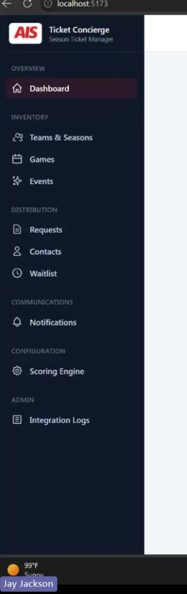

**Dashboard · Teams · Seasons · Games & Events · Requests · Waitlist · Contacts · Reservations · Notifications · Scoring**

Main area: light card layout — page title + subtitle top‑left, primary action(s) top‑right, then cards/tables.
Note the nav **already reads "Games & Events"** (not just "Games").

**Acceptance checklist**
- [ ] All 10 sections present in the nav, in this order, with these exact labels.
- [ ] "Games & Events" label (not "Games").
- [ ] Consistent page shell: title + subtitle + top‑right actions + card/table body.

 

---

## 1. Dashboard  — *video 0:10*

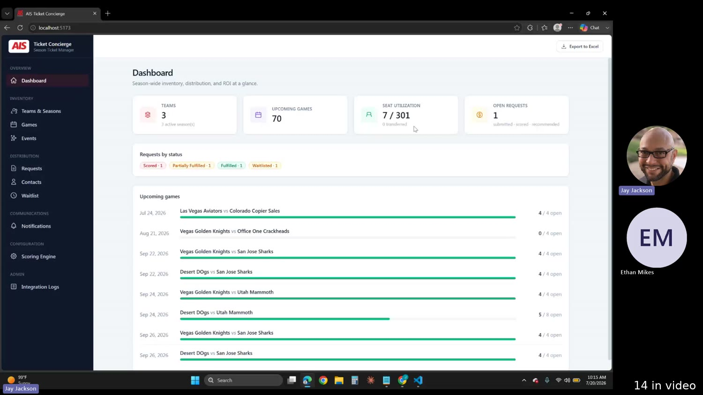

Landing screen: four summary stat cards, then an upcoming‑games list.

**Acceptance checklist**
- [ ] Four stat cards: **teams scheduled**, **upcoming games**, **seats used**, **open requests**.
- [ ] Counts are live aggregates over the real data.
- [ ] **Upcoming Games** list below the cards.
- [ ] Each upcoming‑game row is **clickable** and opens that game's detail page.

---

## 2. Teams  — *video 0:35*

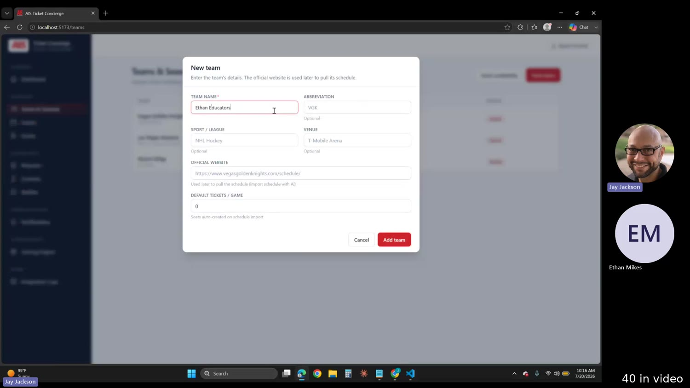

Teams shown as cards; an **Add New Team** modal creates one.

**Acceptance checklist**
- [ ] Teams listed as cards.
- [ ] "Add / New Team" opens a modal with: **Team name**, **Abbreviation**, **Default tickets**, (color/accent).
- [ ] **Default tickets pre‑fills to `10`.**
- [ ] Default‑tickets value seeds the team's per‑game ticket/seat count.

---

## 3. Seasons  — *video 0:58*

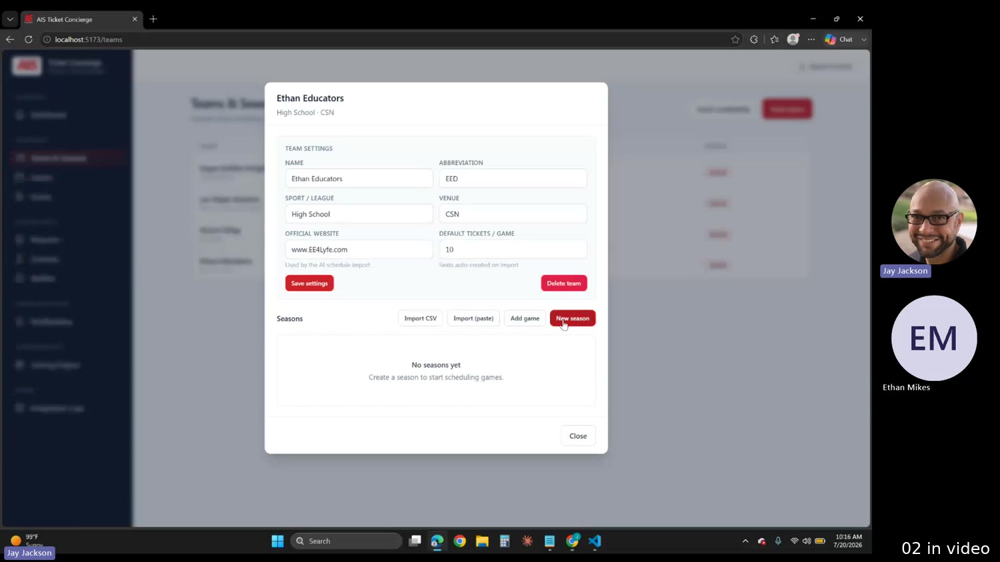

Seasons are **containers for games**; cards with status + games count.

**Acceptance checklist**
- [ ] Create a season (e.g. "2026 Season").
- [ ] **Multiple seasons** can coexist.
- [ ] **Activate** and **Complete** actions per season.
- [ ] Status reflects **active / completed** (and a default inactive/draft).
- [ ] New games default to the **active** season.

---

## 4. Games & Events  — *video 1:20*  ⭐

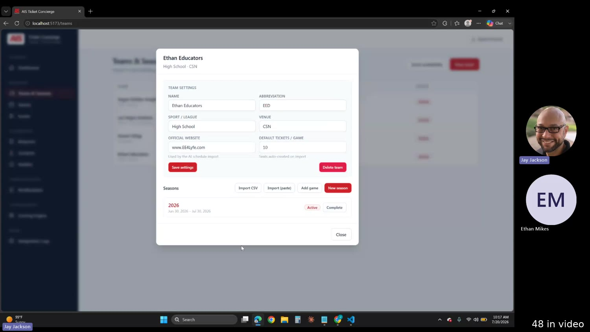

Holds games **and** non‑game events in one section. Jay: *"it should be games and events. Rename that. So if
it's not a game, I can put it there."*

**Acceptance checklist**
- [ ] Section, nav label, and page title all read **"Games & Events."**
- [ ] Can add a **non‑game event** in the same place as a game.
- [ ] Top‑right actions: **Download Template**, **Import CSV**, **Add Game/Event**.
- [ ] CSV import parses the template and creates the games/events in the list.
- [ ] Rows show matchup/opponent, date, seats/availability; default to current season.

---

## 5. Game detail — seats  — *video 1:57*

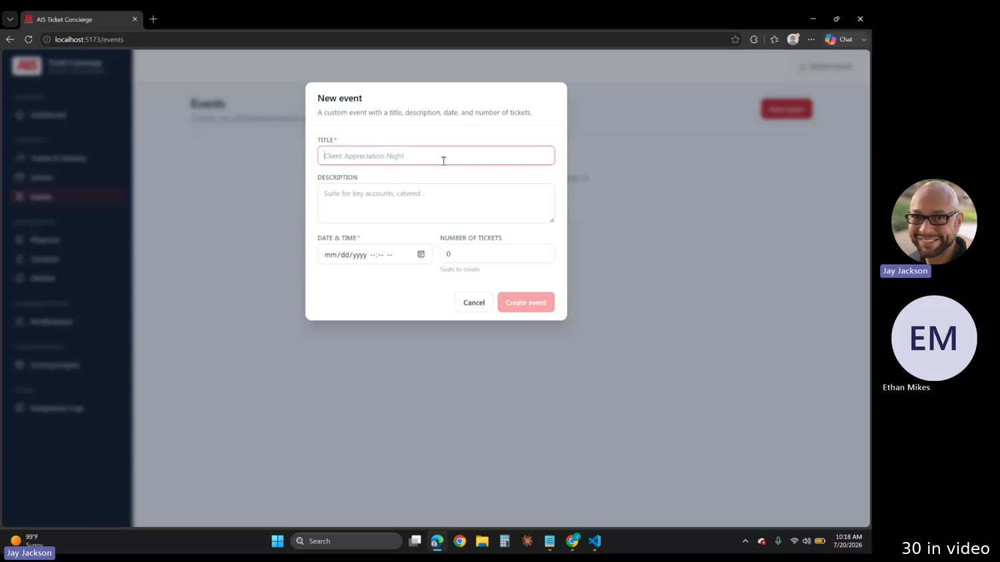

Game header + **Seats** section + **Requests** section.

**Acceptance checklist**
- [ ] Header shows matchup/title, date, season.
- [ ] Seats list shows each seat and total seat count.
- [ ] **Add Seat** lets you set a **seat type** (mixed types per game supported).
- [ ] Optional **priority rank** field present (not required).
- [ ] Requests for this game appear on the page.

---

## 6. Requests — create  — *video 2:40*

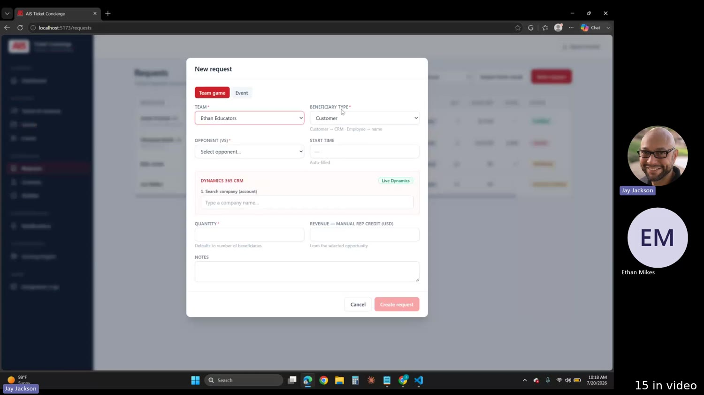

**Acceptance checklist**
- [ ] "New request" opens a form.
- [ ] Pick **Team or Event**.
- [ ] **Requester type** toggle: **Customer / Employee**.
- [ ] **Opponent** dropdown shows the **date next to each opponent**.
- [ ] **Number of seats** field.

---

## 7. Requests — customer / CRM lookup  — *video 3:15*

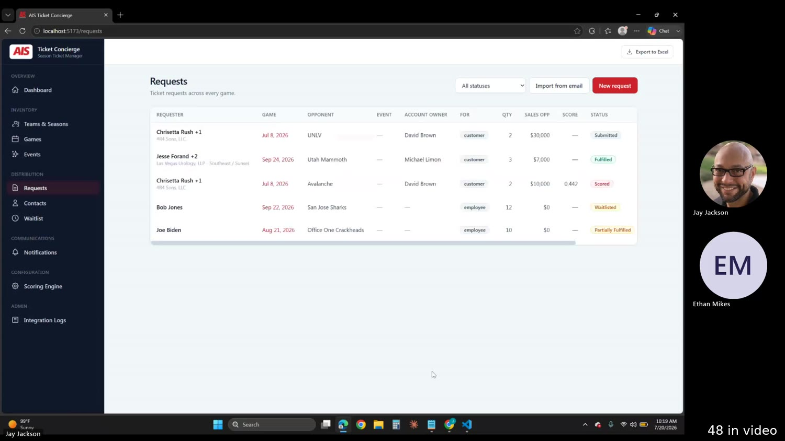

When requester = **Customer**, pull from CRM.

**Acceptance checklist**
- [ ] Reads **Accounts/Contacts**: pick a customer → shows the account and its available contacts.
- [ ] Reads **Opportunities**: surfaces which are **open**.
- [ ] **Open opportunities feed the scoring calculator.**
- [ ] *(Our build)* lookups are backed by **Dataverse/CRM**; if unwired, behind an adapter + `TODO(jay)`.

---

## 8. Seat assignment & attendance  — *video 3:45*

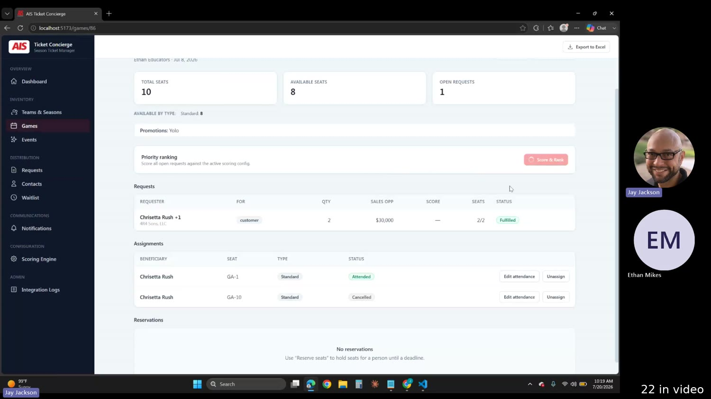

**Acceptance checklist**
- [ ] Submitted request appears on the game.
- [ ] **Assign seats** to the request; assign a seat to a specific **contact**.
- [ ] **Unassign** available.
- [ ] **Record attendance**: **Attended / No‑show / Canceled**.
- [ ] **Score & Rank** action present (placeholder ok).
- [ ] Attendance outcome feeds the contact's score.

---

## 9. Contacts  — *video 4:37*

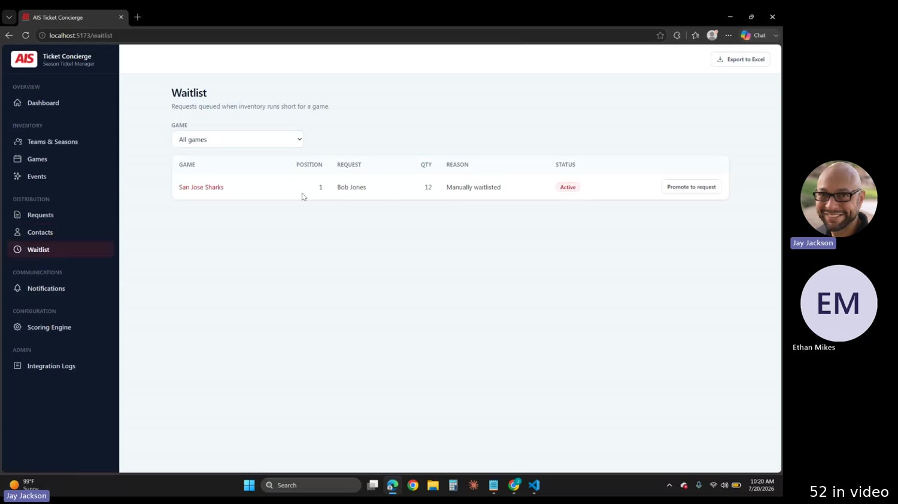

**Acceptance checklist**
- [ ] Receiving a ticket **auto‑creates a contact**.
- [ ] Contact **history** shows past attended/canceled.
- [ ] History **affects the contact's score**.

---

## 10. Waitlist  — *video 4:52*

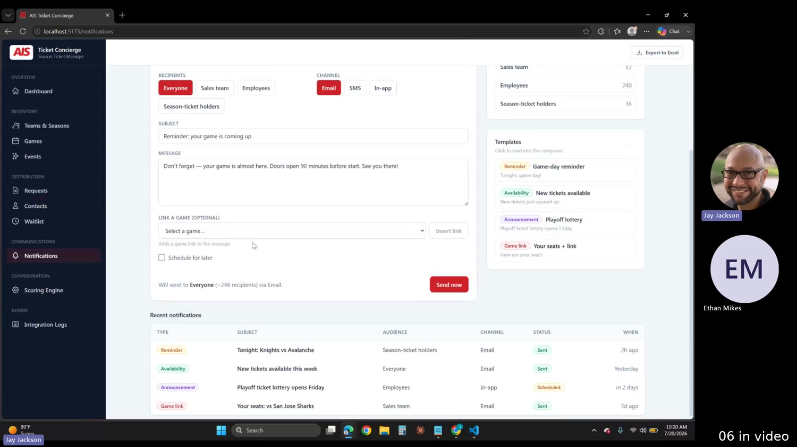

**Acceptance checklist**
- [ ] A request can be **moved to the waitlist**.
- [ ] A waitlisted entry can be **promoted back to a request**.
- [ ] Meant for when requests exceed available tickets.

---

## 11. Notifications  — *video 5:03*  — *lowest priority, expect iteration*

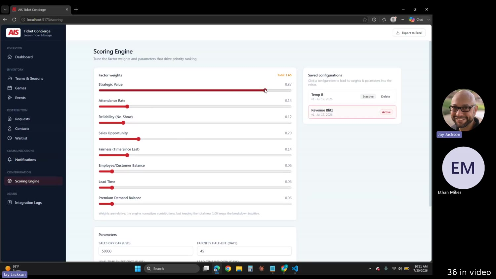

Reminder engine for ticket holders.

**Acceptance checklist**
- [ ] Assign reminders to ticket holders on **some cadence** via **some channel**.
- [ ] Rules have a **published** state.
- [ ] Minimal first pass only; **stub actual sending** + `TODO(jay)`.
- [ ] Build **last**; expect tweaks (do with Jay).

---

## 12. Scoring engine  — *video 5:34*  — *placeholder only*

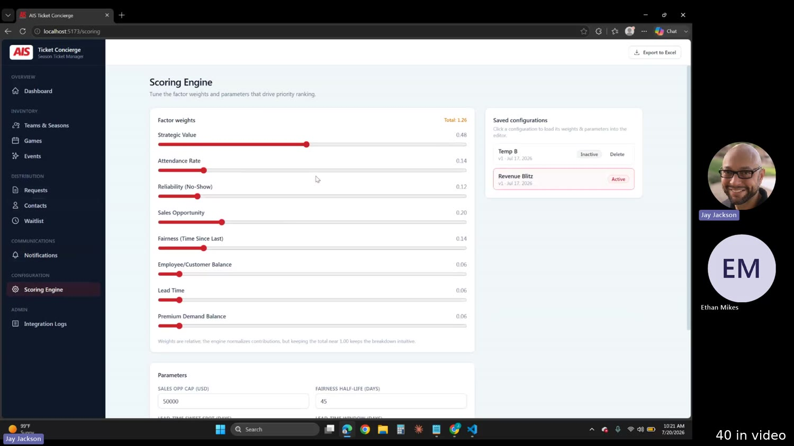

Scores/ranks requests by priority from the data.

**Acceptance checklist**
- [ ] Score/rank surface exists.
- [ ] Extension point can consume **open opportunity value** + **attendance history**.
- [ ] **No invented formula** — stub with `TODO(jay): scoring metrics`.

---

## 13. Reservations  — *video 5:48*

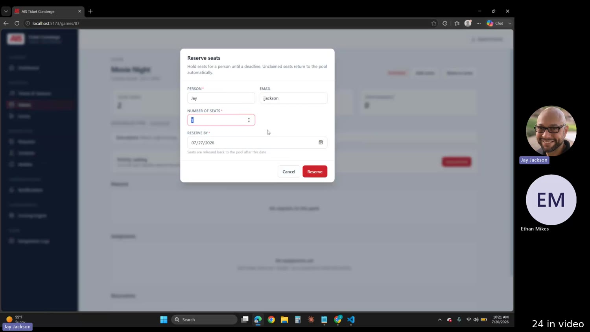

Hold a seat before it's requested/assigned.

**Acceptance checklist**
- [ ] **Reserve a seat with an email address**, until a **deadline/time frame**.
- [ ] Reserved seat is **removed from inventory** (not requestable/assignable).
- [ ] On **expiry** the seat returns to inventory; **assignment** also ends the hold.
- [ ] Reserver is a generic **employee lookup** (not hard‑coded to a person).
- [ ] Reservations list shows email + expiry + status.

---

# PART 3 — Reference tables

## Data model (inferred — a checklist, not gospel)

| Entity | Key fields |
|---|---|
| **Team** | name, abbreviation, default_tickets (default 10), color |
| **Season** | name, status (active / completed / draft), is_active, games_count |
| **Game / Event** | season, type (game \| event), opponent/title, date, seat_count |
| **Seat** | game, type, status (available / assigned / reserved), priority_rank (optional) |
| **Request** | team_or_event, requester_type (customer \| employee), opponent, account, contact, opportunity, seats_requested, status, waitlisted (bool), score |
| **Contact** | name, email, attendance_history (attended / no‑show / canceled), score |
| **Reservation** | seat, email, reserved_by (employee), expires_at, status |
| **Notification** | name, cadence, channel, published (bool) |

CRM‑sourced (our Dataverse): **Accounts**, **Contacts**, **Opportunities** (open opps feed scoring).

## Open questions Jay left unfinished
- **Scoring metrics** — undefined → placeholder + extension point only.
- **CRM connection** — "ideal," OK to mock initially → adapter + `TODO(jay)`.
- **Notifications** — cadence/channel not final; do last, together, expect tweaks.
- **Reservation owner** — employee vs. a named person (Rosa) undecided → keep generic (reserve by email).

## Build order
Dashboard → Teams → Seasons → Games & Events (incl. CSV import) → Game detail/seats → Requests (+ CRM lookup)
→ Assignment/attendance → Contacts → Waitlist → Reservations. **Then last:** Scoring (placeholder),
Notifications (minimal, for review).

> Project context: the ticketing app is **low priority** vs. other work (the "blue teams" video and
> field‑activity app come first); the notification manager is the very last item.
